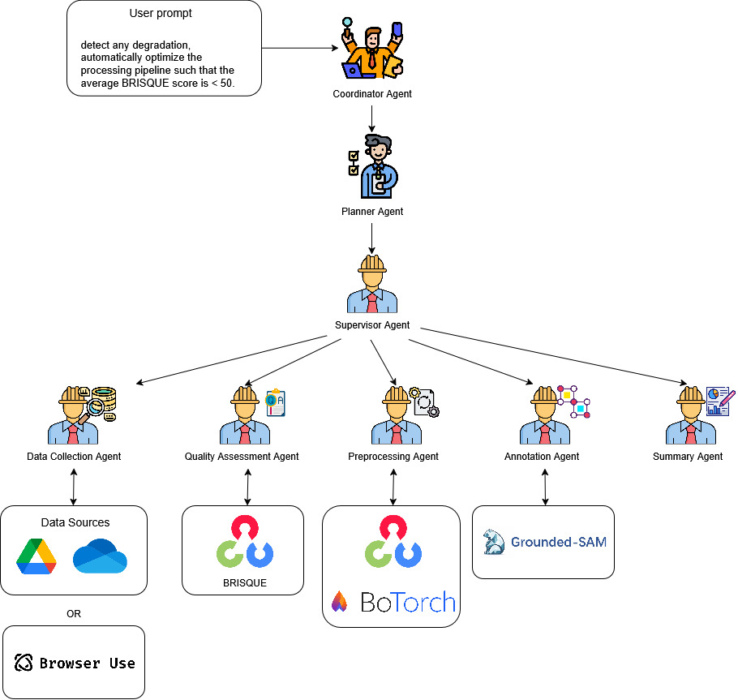

<p align="center">
  
</p>

<p align="center">
  <h1 align="center">AgenticVision : An Agentic Data Preprocessing Framework</h1>
</p>

<p align="center">
  <a href="https://www.python.org/downloads/release/python-3120/">
    
  </a>
  <a href="https://github.com/astral-sh/uv">
    
  </a>
  <a href="https://github.com/langchain-ai/langgraph">
    
  </a>
  <a href="https://opencv.org/">
    
  </a>
  <a href="https://botorch.org/">
    
  </a>
  <a href="https://github.com/langchain-ai/langchain">
    
  </a>
  <a href="https://dvc.org/">
    
  </a>
  <a href="https://platform.openai.com/docs/models">
    
  </a>
</p>

- AgenticVision enables users to generate optimal data preprocessing pipelines from natural language prompts.
- It automates the selection and tuning of preprocessing steps to maximize data quality for downstream tasks.

### Setup

#### Install package manager 
```bash
pip install uv
```

#### Create and activate virtual environment through uv
```bash
uv python install 3.12
uv venv --python 3.12
source .venv/bin/activate  # On Windows: .venv\Scripts\activate
```

#### Install dependencies
```bash
uv sync
```

#### Configure .env file in environment

#### Start a local server
```bash
uv run server.py
```
The above will start a cli session at http://0.0.0.0:8000 

### Frontend

Please refer to the steps in [AI-DA-STC/generative-ai-agentic-cv-frontend](https://github.com/AI-DA-STC/generative-ai-agentic-cv-frontend.git) to setup the frontend

## Technology stack


## Agent Architecture 



The key components of the Agent DAG architecture is given below : 

1. Coordinator Agent : Responsible for Intent recognition, classifying into : 
Technical : A data processing request. Forward to planner. 
Non-technical : Greetings. Direct replies to user.
2. Planner Agent : Generates schedule/pipeline of the necessary agents and tools required in json and hands over to supervisor
3. Supervisor : 
    - Executes the pipeline by ensuring each step is complete
    - Efficient handover between agents.
    - Retry mechanism, if agent fails
4. Data Collection Agent : 
    - Manual: Connect to google drive and OneDrive 
    - Automatic: Use [browser-use](https://github.com/browser-use/browser-use) agents to download datasets from any source (please specify in prompt). 
5. Quality Assessment Agent : Calculate [BRISQUE](https://learnopencv.com/image-quality-assessment-brisque/) based severity scores based on following logic : 

| BRISQUE Score Range | Severity Level | Description    |
|---------------------|---------------|---------------|
| 0 - 20              | 1             | Very Low      |
| 21 - 40             | 2             | Low           |
| 41 - 60             | 3             | Medium        |
| 61 - 80             | 4             | High          |
| 81 - 100            | 5             | Very High     |

6. Data preprocessing Agent : Search for optimal openCV based preprocessing pipeline using Bayesian Optimization powered by [BoTorch](https://github.com/pytorch/botorch)

#### Bayesian Optimisation of Pre-processing Pipelines

Given a batch of degraded images $I_1,\dots,I_N$ of the **same severity** bucket (medium, high, very high) we search for the 3-stage OpenCV pipeline that minimises the *mean* BRISQUE score over the batch.

Mathematically, each candidate pipeline is encoded as the 7-dimensional vector

$$
\mathbf{x} = (f_1, f_2, f_3, k, c, \alpha, \gamma),
$$

where  
• $f_i\in\{0,\dots,9\}$ chooses the operator for stage $i$  
    0-4 : deblurring / denoising  
    5-6 : histogram equalisation  
    7-8 : gamma / linear intensity mapping  
    9    : *noop* (drop stage)  
• $k$ (odd) : kernel size or spatial diameter,  
• $c$ : CLAHE clip limit,  
• $\alpha$ : linear intensity scale,  
• $\gamma$ : gamma exponent.

The optimisation problem is

$$
\min_{\mathbf{x}\in\mathcal D} \; f(\mathbf{x}) = 
\frac{1}{N}\sum_{j=1}^{N} \operatorname{BRISQUE}\!\bigl(\mathrm{Pipeline}(\mathbf{x}, I_j)\bigr).
$$

### Severity-aware search bounds

| Severity bucket | $k_\text{min}$ | $k_\text{max}$ | Comment |
|-----------------|------------------|------------------|---------|
| medium          | 1                | 2                | favour light smoothing |
| high            | 1                | 3                | allow stronger blur |
| very high       | 2                | 3                | enforce aggressive blur |

These bounds are implemented in `src/utils/optimize_preprocess.py` (see `optimise_severity`, lines 239-249).

### Bayesian optimisation loop

The core routine `optimise_severity` (same file) proceeds as follows:

1. **Sobol initialisation**  
   Sample $n_\text{init}=20$ quasi-random points $\mathbf{x}$ in the real-valued domain $\mathcal D$; decode to discrete indices + hyper-parameters and evaluate $f(\mathbf{x})$.

2. **GP model fitting**  
   Fit a `SingleTaskGP` on the normalised design set using maximum marginal likelihood.

3. **Acquisition optimisation**  
   With the fitted GP build a *q-Log Expected Improvement* acquisition  
   $$
   q_\mathrm{qEI}(\mathbf X_{q}) = \mathbb E\!\left[\max\bigl(f_\text{best}-\min_i f(\mathbf x_i), 0\bigr)\right]
   $$
   and optimise it in the unit cube to obtain the next batch ($q=4$) of candidates (`optimize_acqf`).

4. **Augment data & iterate**  
   De-normalise, round/clip integers, project to valid odd $k$ etc., evaluate BRISQUE and append $(\mathbf x, f(\mathbf x))$.  
   Repeat GP fitting + acquisition for $n_\text{iter}=30$ iterations.

5. **Persist best pipeline**  
   The lowest-scoring pipeline is written to `artefacts/pipelines/<severity>.json` and, if `processed_path` is provided, the processed images are saved for inspection.

See [`src/utils/optimize_preprocess.py`](src/utils/optimize_preprocess.py) for the full implementation.


### TO DO : Add evaluations and benchmarks to evaluate performance
1. Data Throughput: Number of raw images/videos processed per hour/day (e.g ≥ 10,000 items/hour).
2. Error Rate: % of pipeline failures or manual interventions per 1,000 jobs (≤ 1 %)
3. Quality improvement: % improvement of a standardized quality metric. (≥ 10% improvement in BRISQUE)