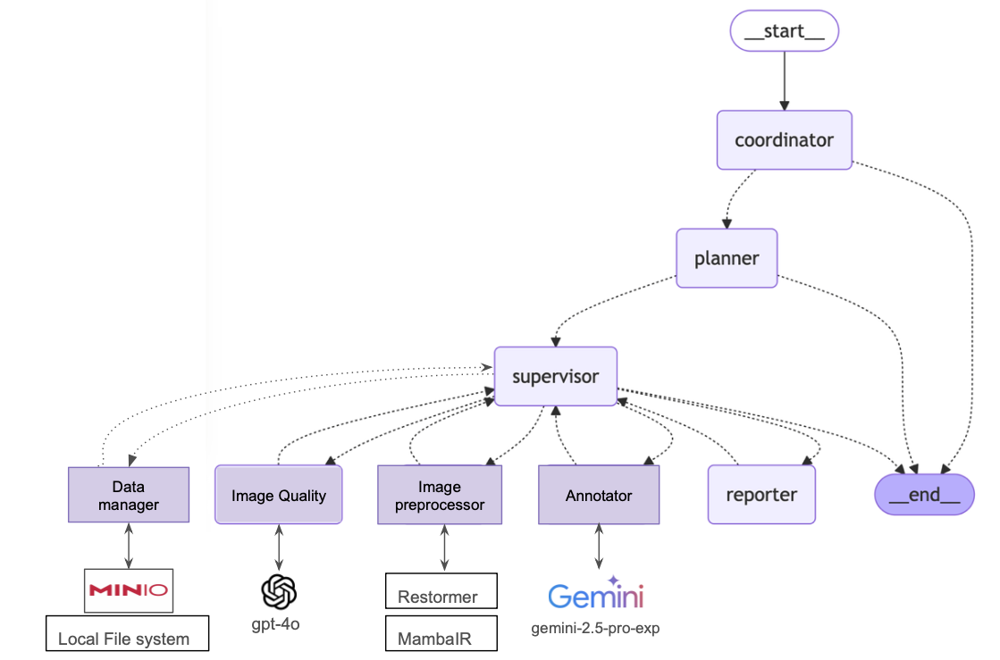

### Agentic Data preprocessing  

The following are key components of the system: 

1. Coordinator : This reasoning model acts as a non-technical friendly interface with the user. Either forwards the incoming request to a planner of particular sub-system or simply replies to the user.
2. Planner : Each subsystem will have a planner which simply returns the schedule/pipeline of the necessary agents and tools required in json and handsover to supervisor
3. Supervisor : Executes the pipeline by ensuring each step is complete and efficient handover between agents. 
4. Agents : Depending on the sub-system , we can use different agents with access to different tools.
5. Tools : Each agent has access to tools (APIs,Repos,libraries etc)

The above components would be common for all sub-systems. 

## Data preprocessing agent



### Setup

#### Install package manager 
```bash
pip install uv
```

#### Create and activate virtual environment through uv
```bash
uv python install 3.12
uv venv --python 3.12
source .venv/bin/activate  # On Windows: .venv\Scripts\activate
```

#### Install dependencies
```bash
uv sync
```

#### Configure .env file in environment

#### Start a local server
```bash
uv run server.py
```
The above will start a cli session at http://0.0.0.0:8000 
